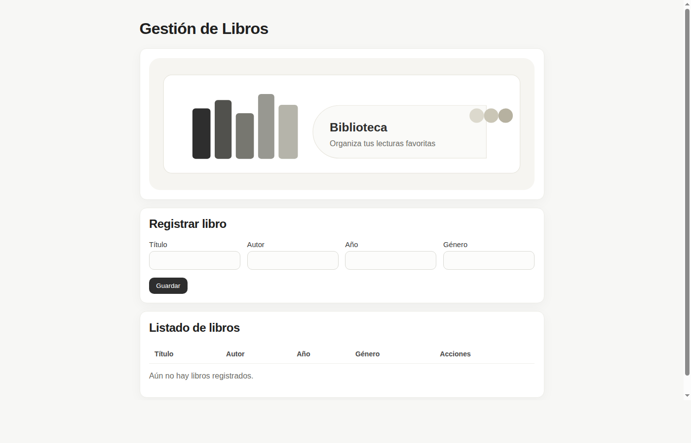

# Biblioteca CRUD

## Descripción
Aplicación web tipo CRUD para gestionar libros de una biblioteca. Permite registrar, consultar, editar y eliminar libros desde una sola interfaz.

## Tecnologías utilizadas
- HTML5
- CSS3
- JavaScript (Vanilla)
- LocalStorage (persistencia en navegador)

## Funcionalidades
- Crear registros de libros.
- Consultar listado de libros guardados.
- Editar registros existentes.
- Eliminar registros.

Cada libro tiene al menos 4 campos:
- Título
- Autor
- Año
- Género

## Instrucciones para ejecutar el proyecto
1. Clona o descarga este repositorio.
2. Abre el archivo `index.html` en tu navegador.
3. Usa el formulario para registrar libros.
4. Usa los botones **Editar** y **Eliminar** en la tabla para gestionar los registros.

> No se requieren instalaciones adicionales ni servidor backend.

## Evidencias o capturas de pantalla
Captura de la interfaz funcional:

## Uso de inteligencia artificial
Sí, se usó IA como apoyo para:
- estructurar rápidamente la solución CRUD,
- revisar redacción del README,
- verificar consistencia general del proyecto.

El desarrollo y validación final del comportamiento de la aplicación se realizó de forma manual.
